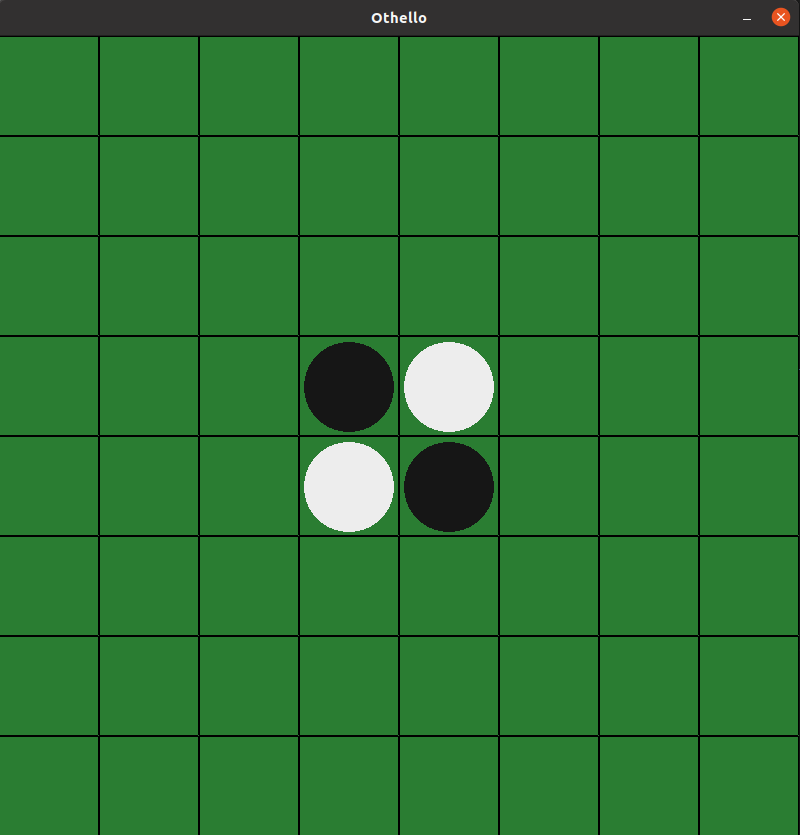
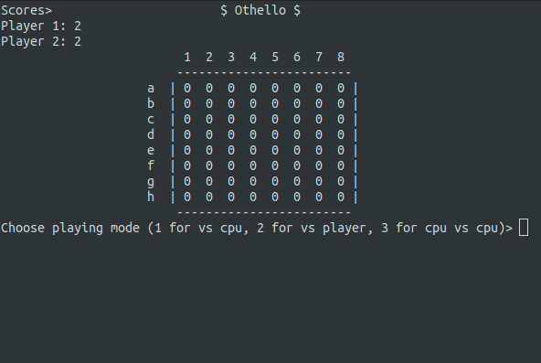

# Othello
Othello game made with C++. The game can be played vs the 2nd player or the CPU.
This game can be played using both CLI and GUI.

## Run

### Install requirements
Before running, you should install requirements:
```
sudo apt-get update
sudo apt-get install build-essential manpages-dev

#install sdl2
sudo apt install libsdl2-dev libsdl2-2.0-0 -y;

#install sdl image  - if you want to display images
sudo apt install libjpeg-dev libwebp-dev libtiff5-dev libsdl2-image-dev libsdl2-image-2.0-0 -y;

#install sdl mixer  - if you want sound
sudo apt install libmikmod-dev libfishsound1-dev libsmpeg-dev liboggz2-dev libflac-dev libfluidsynth-dev libsdl2-mixer-dev libsdl2-mixer-2.0-0 -y;

#install sdl true type fonts - if you want to use text
sudo apt install libfreetype6-dev libsdl2-ttf-dev libsdl2-ttf-2.0-0 -y;
```

## Run GUI
To run the GUI version:

```
chmod +x ./gui-run
./gui-run
```


## Run CLI
To run the CLI version:

```
chmod +x ./cli-run
./cli-run
```
